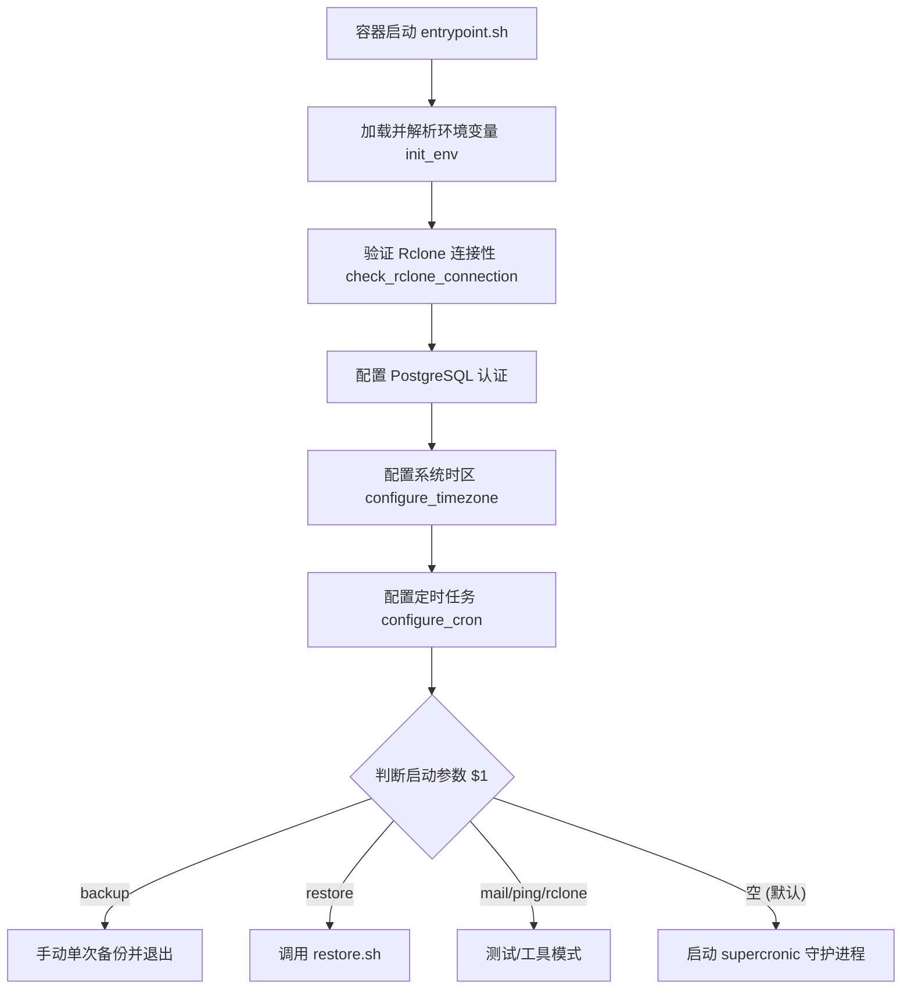

# Vaultwarden Backup 备份流程详细说明

本文档详细描述了本工具目前的备份实现流程、各个阶段的逻辑以及涉及的脚本文件。

## 目录
1. [备份核心组件](#备份核心组件)
2. [备份启动流程 (entrypoint.sh)](#备份启动流程-entrypointsh)
3. [备份执行流程 (backup.sh)](#备份执行流程-backupsh)
   - [第一阶段：环境准备与状态通知](#第一阶段环境准备与状态通知)
   - [第二阶段：临时目录与文件名初始化](#第二阶段临时目录与文件名初始化)
   - [第三阶段：数据提取 (数据库与静态文件)](#第三阶段数据提取-数据库与静态文件)
   - [第四阶段：压缩与加密 (Packaging)](#第四阶段压缩与加密-packaging)
   - [第五阶段：多端上传 (Rclone Upload)](#第五阶段多端上传-rclone-upload)
   - [第六阶段：历史清理 (Retention Policy)](#第六阶段历史清理-retention-policy)
   - [第七阶段：通知与清理](#第七阶段通知与清理)
4. [核心环境变量与配置清单](#核心环境变量与配置清单)

---

## 备份核心组件

备份工具由以下两个主要脚本及一个辅助函数脚本构成：
*   **[entrypoint.sh](file:///Users/xiaozhu/projects/vw-backup/scripts/entrypoint.sh)**：Docker 容器的入口脚本，负责环境检查、系统初始化（时区、Cron）、执行模式分流（手动备份、定时备份、还原等）。
*   **[backup.sh](file:///Users/xiaozhu/projects/vw-backup/scripts/backup.sh)**：核心备份主流程脚本，包含数据导出、压缩包封装、多目的端上传以及过期文件清理等。
*   **[includes.sh](file:///Users/xiaozhu/projects/vw-backup/scripts/includes.sh)**：公共函数库，提供环境变量解析（如 `*_FILE` 优先级）、Rclone 连接验证、通知发送（Webhooks/Ping/SMTP 邮件）等支持。

---

## 备份启动流程 (entrypoint.sh)

当 Docker 容器启动时，`entrypoint.sh` 会首先执行并决定运行模式。



### 详细步骤说明：
1.  **加载并解析环境变量**：调用 `init_env` 函数，按优先级从直接环境变量、`.env` 文件以及 `<VAR>_FILE` 形式的 Docker 密钥中加载配置（支持 Docker Secret 读取方式）。
2.  **验证 Rclone 连接**：调用 `check_rclone_connection all`。检查配置的所有 Rclone Remotes 是否通畅。如果全部失败，容器启动将受阻报错。
3.  **客户端环境配置**：
    *   **PostgreSQL**：生成对应的 `~/.pgpass` 密码文件以支持 `pg_dump` 无密码免交互备份。
    *   **时区配置**：依据环境变量 `TIMEZONE` 调整容器内时区，重新软链接 `/etc/localtime`。
4.  **注册 Cron 任务**：向容器内的 Cron 配置文件中写入定时任务：
    ```text
    [CRON] bash /app/backup.sh
    ```
5.  **模式分流**：
    *   **手动备份 (`backup`)**：输出警告信息后直接调用 `bash /app/backup.sh`，备份结束后容器即退出。
    *   **还原备份 (`restore`)**：调用 `restore.sh` 脚本执行数据恢复。
    *   **工具模式 (`rclone` / `mail` / `ping`)**：可直接调用内置的 `rclone` 指令或测试邮件/通知接口。
    *   **后台守护 (默认)**：使用 `supercronic` 进程管理器在前台挂起，以非阻塞日志模式调度 Cron 备份任务。

---

## 备份执行流程 (backup.sh)

每当 Cron 触发或手动调用时，`backup.sh` 就会运行一个完整的备份生命周期，其具体步骤如下：

### 第一阶段：环境准备与状态通知
1.  调用 `init_env` 初始化本次备份所需的运行环境与变量。
2.  发送备份开始通知（调用 `send_notification "start"`），支持向外部 Ping 服务或 Webhook 接口发送请求。
3.  检查 Rclone 目标端连接性（调用 `check_rclone_connection any`），确保至少有一个配置的云存储端可用。

### 第二阶段：临时目录与文件名初始化
1.  清理之前的本地临时备份目录 `${BACKUP_DIR}`。
2.  生成当前的时间戳后缀 `NOW`（格式由 `BACKUP_FILE_DATE_FORMAT` 决定）。
3.  在临时目录中规划各备份项的临时路径：
    *   **SQLite 数据库**：`db.${NOW}.sqlite3`
    *   **PostgreSQL 数据库**：`db.${NOW}.dump`
    *   **MySQL 数据库**：`db.${NOW}.sql`
    *   **配置文件**：`config.${NOW}.json`
    *   **密钥文件包**：`rsakey.${NOW}.tar`
    *   **附件打包**：`attachments.${NOW}.tar`
    *   **发送文件打包**：`sends.${NOW}.tar`
    *   **最终压缩包**：`backup.${NOW}.${ZIP_TYPE}`

### 第三阶段：数据提取 (数据库与静态文件)
根据配置的环境变量，将 Vaultwarden 的所有关键数据导出并复制 to 临时目录中：

*   **数据库备份**：
    *   **SQLite**：使用命令行 `sqlite3 "${DATA_DB}" ".backup '${BACKUP_FILE_DB_SQLITE}'"`。此官方备份方法能够保证在 Vaultwarden 读写期间获得一致的快照，避免数据库文件损坏。
    *   **PostgreSQL**：使用 `pg_dump -Fc` 工具，导出为 PostgreSQL 自定义的二进制归档压缩格式。
    *   **MySQL/MariaDB**：使用 `mariadb-dump`，附带 SSL 等安全配置参数进行热备份。
*   **配置文件备份**：如果存在数据目录下的 `config.json`，则将其复制为 `config.${NOW}.json`。
*   **RSA 密钥备份**：定位所有 `rsa_key*` 相关的私钥、公钥及证书文件，在临时目录中归档为 `rsakey.${NOW}.tar`。
*   **附件备份 (`attachments`)**：将附件文件夹整体归档为 `attachments.${NOW}.tar`。
*   **Send 备份 (`sends`)**：将 Vaultwarden Sends 文件夹整体归档为 `sends.${NOW}.tar`。

### 第四阶段：压缩与加密 (Packaging)
*   **启用压缩 (`ZIP_ENABLE=TRUE`)**：
    *   利用 `7z` 命令对临时备份目录中的所有导出文件进行强力压缩（压缩率级别为 `9`，即最大压缩）。
    *   支持 `zip` (采用 `-tzip`) 或 `7z` (采用 `-t7z -m0=lzma2`) 两种格式。
    *   使用密码 `${ZIP_PASSWORD}` 对压缩包内所有数据进行加密（在 `7z` 模式下开启了 `-mhe=on` 以对文件名头部进行加密，提高安全性）。
    *   输出生成的压缩包内的文件清单进行日志留存。
*   **不启用压缩 (`ZIP_ENABLE=FALSE`)**：
    *   跳过 7z 打包，直接将带有各文件未解包状态的整个临时备份文件夹 `${BACKUP_DIR}` 作为待上传的目标。

### 第五阶段：多端上传 (Rclone Upload)
1.  校验打包文件是否存在，若缺失则视作备份失败，向外部发送失败通知并退出。
2.  遍历 `RCLONE_REMOTE_LIST` 中配置的所有远程目的地（支持主备/多目的地备份）。
3.  执行 Rclone 命令，将本地打包后的压缩包文件或整个备份文件夹上传至指定的远程存储目录：
    ```bash
    rclone copy [UPLOAD_FILE] [RCLONE_REMOTE]
    ```
4.  如果在其中一个或多个远程端上传时发生网络错误或认证失败，变量 `HAS_ERROR` 会被标为 `TRUE`。

### 第六阶段：历史清理 (Retention Policy)
*   如果配置了 `${BACKUP_KEEP_DAYS}` 大于 0（即启用了保留天数）：
    *   针对每一个配置的 Rclone 远程目标，使用 `rclone lsf` 过滤出修改时间超过 `BACKUP_KEEP_DAYS` 天数的文件：
        ```bash
        rclone lsf "${RCLONE_REMOTE_X}" --min-age "${BACKUP_KEEP_DAYS}d"
        ```
    *   对筛选出的每一个老旧备份文件，执行删除操作：
        ```bash
        rclone delete "${RCLONE_REMOTE_X}/${RCLONE_DELETE_FILE}"
        ```

### 第七阶段：通知与清理
1.  本地再次执行 `clear_dir`，彻底清除容器内留存的敏感临时文件。
2.  **状态反馈**：
    *   若上传出现错误（`HAS_ERROR=TRUE`）：向 Webhook 目标或邮件发送 `failure` 报警邮件/通知，并以非零状态码退出。
    *   若全部成功：发送 `success` 通知（若配置了相应开关），并在日志中输出成功信息。

---

## 核心环境变量与配置清单

以下是控制备份执行过程的关键配置参数：

| 环境变量 | 默认值 | 说明 |
| :--- | :--- | :--- |
| `DB_TYPE` | `SQLITE` | 数据库类型，可选 `SQLITE`、`POSTGRESQL`、`MYSQL`。 |
| `CRON` | `5 * * * *` | 备份定时任务的 Cron 表达式，默认每小时的第 5 分钟执行一次。 |
| `ZIP_ENABLE` | `TRUE` | 是否将导出的备份碎片文件压缩打包成单个包。 |
| `ZIP_TYPE` | `zip` | 压缩格式类型，可选 `zip` 或 `7z`。 |
| `ZIP_PASSWORD` | `WHEREISMYPASSWORD?` | 压缩加密密码。建议设为强密码，在 7z 模式下会连同文件名一同加密。 |
| `BACKUP_KEEP_DAYS` | `0` | 备份保留天数。`0` 表示永久保留，大于 `0` 时将自动清理远程端超出该天数的历史备份。 |
| `RCLONE_REMOTE_NAME` | `BitwardenBackup` | 默认 Rclone 远程配置名。若有多端备份，可通过 `RCLONE_REMOTE_NAME_x` (从 0 开始递增) 形式配置。 |
| `RCLONE_REMOTE_DIR` | `/BitwardenBackup/` | 默认 Rclone 上传目录。可通过 `RCLONE_REMOTE_DIR_x` (从 0 开始递增) 进行多目的地目录配置。 |
| `TIMEZONE` | `UTC` | 备份容器内使用的时区，例如 `Asia/Shanghai`。 |
| `PING_URL` | 无 | 备份完成时（无论成功失败）访问的监控 URL（例如 Uptime Kuma 或 Healthchecks.io）。 |
| `MAIL_SMTP_ENABLE` | `FALSE` | 是否开启 SMTP 邮件通知。 |
