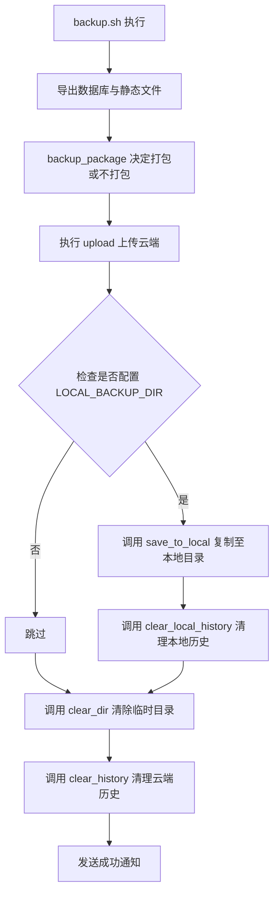

# Vaultwarden 本地备份副本保存方案

本文档针对“在云端 Rclone 备份之外，额外在本地目录保存一份最终备份包/文件”的需求，提出了具体的设计和实现方案。

## 1. 本地备份保存设计方案

### 1.1 新增配置环境变量

为了实现本功能且不破坏现有逻辑，我们引入两个新的环境变量：

| 环境变量 | 默认值 | 说明 |
| :--- | :--- | :--- |
| `LOCAL_BACKUP_DIR` | 无 (空) | 本地备份保存的目标目录路径。如果不配置或为空，则代表**不启用**本地副本保存。例如：`/bitwarden/local_backups` |
| `LOCAL_BACKUP_KEEP_DAYS` | 无 (空) | 本地备份的保留天数。如果未配置，默认使用全局的 `BACKUP_KEEP_DAYS` 变量；若显式配置，则优先使用该参数。 |

---

### 1.2 详细执行流程与修改点

要在不影响 Rclone 上传的情况下保留本地备份，复制本地副本的逻辑必须在 **执行 Rclone 上传之后，且在调用 `clear_dir` 清理临时备份目录之前** 插入。



---

### 1.3 代码修改草案

#### 修改点 1：环境变量初始化 (Modify [scripts/includes.sh](file:///Users/xiaozhu/projects/vw-backup/scripts/includes.sh))

在 `init_env` 中读取和显示这两个变量：

```diff
@@ -383,6 +383,14 @@
     # BACKUP_KEEP_DAYS
     get_env BACKUP_KEEP_DAYS
     BACKUP_KEEP_DAYS="${BACKUP_KEEP_DAYS:-"0"}"
 
+    # LOCAL_BACKUP_DIR
+    get_env LOCAL_BACKUP_DIR
+    LOCAL_BACKUP_DIR="${LOCAL_BACKUP_DIR:-""}"
+
+    # LOCAL_BACKUP_KEEP_DAYS
+    get_env LOCAL_BACKUP_KEEP_DAYS
+    LOCAL_BACKUP_KEEP_DAYS="${LOCAL_BACKUP_KEEP_DAYS:-"${BACKUP_KEEP_DAYS}"}"
+
     # BACKUP_FILE_DATE_FORMAT
     get_env BACKUP_FILE_SUFFIX
```

并且在 `init_env` 日志输出末尾增加相应状态的打印：

```diff
@@ -428,6 +436,10 @@
     color yellow "BACKUP_FILE_DATE_FORMAT: ${BACKUP_FILE_DATE_FORMAT} (example \"[filename].$(date +"${BACKUP_FILE_DATE_FORMAT}").[ext]\")"
     color yellow "BACKUP_KEEP_DAYS: ${BACKUP_KEEP_DAYS}"
+    if [[ -n "${LOCAL_BACKUP_DIR}" ]]; then
+        color yellow "LOCAL_BACKUP_DIR: ${LOCAL_BACKUP_DIR}"
+        color yellow "LOCAL_BACKUP_KEEP_DAYS: ${LOCAL_BACKUP_KEEP_DAYS}"
+    fi
```

#### 修改点 2：本地保存与历史清理逻辑 (Modify [scripts/backup.sh](file:///Users/xiaozhu/projects/vw-backup/scripts/backup.sh))

在 `backup.sh` 中增加两个核心函数 `save_to_local` 和 `clear_local_history`，并在主流程中调用它们：

```bash
function save_to_local() {
    if [[ -n "${LOCAL_BACKUP_DIR}" ]]; then
        color blue "save backup file to local directory: ${LOCAL_BACKUP_DIR}"
        
        # 确保目标本地目录存在
        mkdir -p "${LOCAL_BACKUP_DIR}"
        
        if [[ -d "${UPLOAD_FILE}" ]]; then
            # 如果没有压缩打包 (ZIP_ENABLE=FALSE)，UPLOAD_FILE 是临时备份目录。
            # 为了防止多次备份的文件在本地混杂在一起，在本地创建一个以时间命名的子文件夹进行存储。
            local TARGET_SUBDIR="${LOCAL_BACKUP_DIR}/backup.${NOW}"
            mkdir -p "${TARGET_SUBDIR}"
            cp -rf "${UPLOAD_FILE}"/. "${TARGET_SUBDIR}/"
        else
            # 如果打包了 (ZIP_ENABLE=TRUE)，UPLOAD_FILE 是压缩包文件。
            # 直接拷贝到本地目标目录。
            cp -f "${UPLOAD_FILE}" "${LOCAL_BACKUP_DIR}/"
        fi
        
        if [[ $? == 0 ]]; then
            color green "successfully saved to local"
        else
            color red "save to local failed"
            # 注意：本地保存失败不应导致整个备份任务被强行标记为失败，
            # 可以只记录日志，当然也可以根据需求抛出异常，这里推荐打印错误继续。
        fi
    fi
}

function clear_local_history() {
    if [[ -n "${LOCAL_BACKUP_DIR}" && "${LOCAL_BACKUP_KEEP_DAYS}" -gt 0 ]]; then
        color blue "delete ${LOCAL_BACKUP_KEEP_DAYS} days ago local backup files"
        
        if [[ -d "${LOCAL_BACKUP_DIR}" ]]; then
            # 查找 LOCAL_BACKUP_DIR 下修改时间超过 LOCAL_BACKUP_KEEP_DAYS 的所有文件及文件夹并删除
            # -mindepth 1 确保不会误删 LOCAL_BACKUP_DIR 根目录本身
            find "${LOCAL_BACKUP_DIR}" -mindepth 1 -mtime +"${LOCAL_BACKUP_KEEP_DAYS}" -delete
        fi
    fi
}
```

在底部的运行主流逻辑中串联执行：

```diff
@@ -242,5 +242,7 @@
 backup_package
 upload
+save_to_local
 clear_dir
+clear_local_history
 clear_history
 
 send_notification "success" "The file was successfully uploaded at $(date +"%Y-%m-%d %H:%M:%S %Z")."
```

---

## 2. 部署使用方法

若本方案获得批准，用户可以通过在 Docker 容器启动时增加挂载与环境变量来启用本地备份：

1. **挂载宿主机目录**：
   在 `docker-compose.yml` 中，将宿主机想保存备份的路径挂载至容器内（如 `/bitwarden/local_backups`）：

   ```yaml
   volumes:
     - /home/andy/docker/vaultwarden/local_backups:/bitwarden/local_backups
   ```

2. **配置环境变量**：
   在环境变量中开启配置：

   ```yaml
   environment:
     - LOCAL_BACKUP_DIR=/bitwarden/local_backups
     - LOCAL_BACKUP_KEEP_DAYS=1000 # 本地保留 1000 天
   ```
